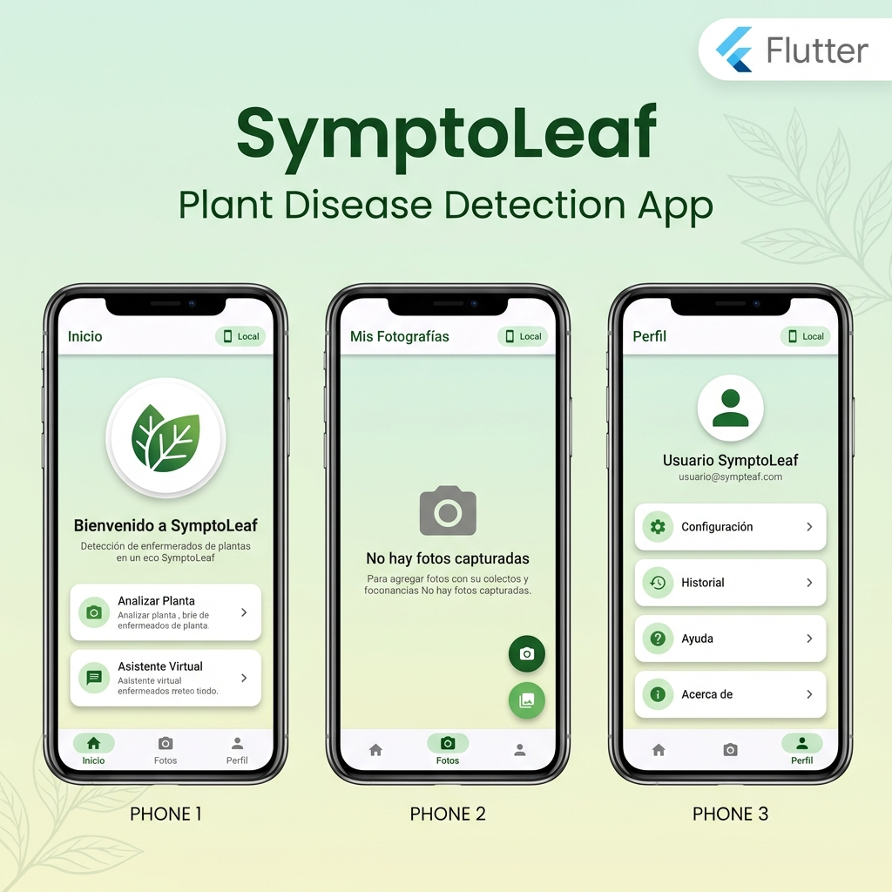

# 🌿 SymptoLeaf

<div align="center">


**Aplicación móvil inteligente para la detección de enfermedades en plantas usando Machine Learning e IA Generativa**

[Características](#-características) •
[Capturas](#-capturas-de-pantalla) •
[Tecnologías](#️-tecnologías) •
[Instalación](#-instalación) •
[Arquitectura](#-arquitectura) •
[Modelo ML](#-modelo-de-machine-learning)

</div>

---

## 📱 Descripción

**SymptoLeaf** es una aplicación Flutter de última generación que combina **Machine Learning on-device** con **IA Generativa (Google Gemini)** para proporcionar un sistema completo de diagnóstico y tratamiento de enfermedades en plantas.

### 🎯 Problema que Resuelve

Los agricultores y jardineros necesitan identificar rápidamente enfermedades en sus plantas para aplicar tratamientos efectivos. SymptoLeaf proporciona:
- ✅ **Diagnóstico instantáneo** mediante análisis de imagen
- ✅ **Recomendaciones de tratamiento** personalizadas con IA
- ✅ **Asistente virtual** para consultas agrícolas 24/7
- ✅ **Funcionalidad offline** para zonas rurales sin internet

## 📸 Capturas de Pantalla

<div align="center">



*Interfaz principal de SymptoLeaf: Sistema de navegación con 3 secciones - Inicio, Galería de Fotos y Perfil de Usuario*

</div>

## ✨ Características

### 🔬 Detección de Enfermedades
- 🔍 **Análisis en tiempo real** - Detección instantánea usando modelo ONNX ResNet50
- 📷 **Captura de cámara** - Toma fotos directamente desde la app con configuración optimizada
- 🖼️ **Selección de galería** - Analiza fotos existentes de tu dispositivo
- 🤖 **ML On-Device** - Inferencia local usando ONNX Runtime (100% offline)
- ☁️ **Modo servidor** - Opción de usar servidor remoto para análisis

### 🤖 Inteligencia Artificial
- 🧠 **Google Gemini AI** - Recomendaciones detalladas de tratamiento
- 💬 **Chatbot agrícola** - Asistente virtual para consultas sobre cuidados de plantas
- 🌍 **Multiidioma** - Resultados en español con nombres científicos y comunes
- 📊 **Análisis detallado** - Información sobre síntomas, causas y prevención

### 🎨 Interfaz de Usuario
- 🧭 **Navegación intuitiva** - BottomNavigationBar con 3 secciones principales
- 🎨 **Diseño Eco-Clean** - Tema verde con gradientes suaves y animaciones Lottie
- 📱 **Indicador de modo** - Chip visual que muestra Modelo Local/Servidor activo
- 🔄 **Cambio rápido de modo** - Diálogo para alternar entre modos fácilmente
- 📸 **Gestión de fotos** - Sistema MVC para captura, almacenamiento y análisis

### 🏗️ Arquitectura
- 🏛️ **Clean Architecture** - Separación clara de capas (Data, Domain, Presentation)
- 🎭 **Patrón MVC** - Modelo-Vista-Controlador con Provider para estado
- 🔌 **Provider Pattern** - Gestión de estado reactiva y escalable
- ♻️ **Widgets reutilizables** - Componentes modulares y testeables

## 🛠️ Tecnologías

### Core Framework
| Tecnología | Versión | Uso |
|-----------|---------|-----|
| **Flutter** | 3.9+ | Framework multiplataforma |
| **Dart** | 3.9+ | Lenguaje de programación |

### Machine Learning & IA
| Tecnología | Versión | Uso |
|-----------|---------|-----|
| **ONNX Runtime** | 1.4.1 | Inferencia de modelo ML on-device |
| **Google Gemini AI** | 0.4.3 | Recomendaciones y chatbot |
| **Image Processing** | 4.1.7 | Preprocesamiento de imágenes |

### Estado & Navegación
| Tecnología | Versión | Uso |
|-----------|---------|-----|
| **Provider** | 6.1.0 | Gestión de estado (MVC Pattern) |
| **Shared Preferences** | 2.2.2 | Persistencia de configuración |

### Captura de Imágenes
| Tecnología | Versión | Uso |
|-----------|---------|-----|
| **Camera** | 0.10.5 | Control de cámara nativo |
| **Image Picker** | 1.0.4 | Selección de galería |

### UI/UX
| Tecnología | Versión | Uso |
|-----------|---------|-----|
| **Lottie** | 3.0.0 | Animaciones JSON |
| **Material Design** | 3.0 | Sistema de diseño |

### Utilidades
| Tecnología | Versión | Uso |
|-----------|---------|-----|
| **HTTP** | 1.2.0 | Comunicación con servidor (opcional) |
| **Path Provider** | 2.1.2 | Acceso a rutas del sistema |

## 📁 Arquitectura

El proyecto implementa **Clean Architecture** con patrón **MVC (Modelo-Vista-Controlador)**:

```
lib/
├── config/              # Configuración global de la app
│   └── theme/           # Temas y estilos
├── data/                # Capa de datos
│   ├── models/          # Modelos de datos
│   ├── repositories/    # Implementación de repositorios
│   └── services/        # Servicios (API, Gemini, etc.)
├── domain/              # Capa de dominio
│   ├── entities/        # Entidades de negocio
│   └── usecases/        # Casos de uso
├── presentation/        # Capa de presentación (UI)
│   ├── models/          # Modelos de UI (Foto, ChatMessage)
│   ├── providers/       # Estado con ChangeNotifier
│   │   └── foto_provider.dart
│   ├── controllers/     # Lógica de negocio
│   │   └── foto_controller.dart
│   ├── viewmodels/      # ViewModels
│   │   ├── prediction_viewmodel.dart
│   │   ├── settings_viewmodel.dart
│   │   └── gemini_viewmodel.dart
│   ├── views/           # Pantallas
│   │   ├── main_screen.dart        # Hub principal con BottomNav
│   │   ├── home_screen.dart        # Inicio
│   │   ├── camera_screen.dart      # Galería de fotos
│   │   ├── perfil_screen.dart      # Perfil de usuario
│   │   ├── result_screen.dart      # Resultados de análisis
│   │   ├── chat_screen.dart        # Chatbot Gemini
│   │   └── welcome_screen.dart     # Pantalla de bienvenida
│   ├── widgets/         # Widgets reutilizables
│   │   └── foto_item.dart
│   ├── temas/           # Sistema de temas
│   │   ├── esquema_color.dart
│   │   ├── tipografia.dart
│   │   └── tema_general.dart
│   └── routes/          # Navegación
│       └── app_routes.dart
└── main.dart            # Punto de entrada
```

### Flujo de Datos - Patrón MVC

```
Usuario
  ↓
Vista (CameraScreen)
  ↓
Controlador (FotoController)
  ↓
Modelo (Foto) ← Provider (FotoProvider)
  ↓
ViewModel (PredictionViewModel)
  ↓
Service (ONNX Runtime / Gemini AI)
  ↓
Vista actualizada (ResultScreen)
```

### Componentes Clave

#### 🎨 **Presentation Layer**
- **Views**: Pantallas sin lógica de negocio (StatelessWidget)
- **ViewModels**: Gestión de estado con ChangeNotifier
- **Controllers**: Lógica de negocio específica (ej: captura de fotos)
- **Providers**: Estado global compartido

#### 📊 **Data Layer**
- **Models**: Representación de datos
- **Services**: Comunicación con APIs externas y modelo ML
- **Repositories**: Abstracción de fuentes de datos

## 🚀 Instalación

### Prerrequisitos

- ✅ Flutter SDK 3.9 o superior
- ✅ Android Studio o VS Code con extensiones Flutter/Dart
- ✅ Dispositivo Android (API 21+) o iOS (11.0+)
- ✅ Clave API de Google Gemini (para funciones de IA)

### Pasos de Instalación

1. **Clona el repositorio**
   ```bash
   git clone https://github.com/AMVMesias/SymptoLeaf.git
   cd SymptoLeaf
   ```

2. **Instala las dependencias**
   ```bash
   flutter pub get
   ```

3. **Configura la API Key de Gemini**
   
   Crea un archivo `.keyapigemeni` en `lib/` con tu API key:
   ```
   lib/.keyapigemeni
   ```
   
   Contenido:
   ```
   TU_API_KEY_AQUI
   ```

4. **Verifica los assets**
   
   Asegúrate de que los modelos estén en:
   ```
   assets/modelo/plant_disease_model.onnx
   assets/modelo/clases.json
   assets/modelo/clases_es.json
   ```

5. **Ejecuta la aplicación**
   ```bash
   flutter run
   ```

## 📖 Uso

### Flujo Básico

1. **Inicio de la App**
   - Pantalla de bienvenida con animación
   - Acceso directo a MainScreen con BottomNavigationBar

2. **Detección de Enfermedad**
   - Navega a "Fotos" desde la barra inferior
   - Opciones:
     - 📷 **Tomar foto**: Captura con cámara optimizada
     - 🖼️ **Galería**: Selecciona imagen existente
   - Presiona "Analizar" en la foto capturada

3. **Revisión de Resultados**
   - Visualiza el diagnóstico con porcentaje de confianza
   - Lee recomendaciones de tratamiento generadas por Gemini AI
   - Accede a información detallada sobre la enfermedad

4. **Consulta al Asistente**
   - Desde "Inicio", toca "Asistente Virtual"
   - Haz preguntas sobre cuidados de plantas
   - Recibe respuestas personalizadas de Gemini AI

5. **Cambio de Modo**
   - Toca el chip "Local/Servidor" en el AppBar
   - Selecciona el modo preferido:
     - 📱 **Local**: Funciona sin internet
     - ☁️ **Servidor**: Requiere conexión, mayor precisión

## 🧠 Modelo de Machine Learning

### Especificaciones Técnicas

- **Arquitectura**: ResNet50 (Deep Residual Network)
- **Framework Original**: TensorFlow/Keras
- **Formato**: ONNX (Open Neural Network Exchange)
- **Tamaño del Modelo**: ~100 MB
- **Dataset de Entrenamiento**: PlantVillage (54,000+ imágenes)
- **Clases**: 38 categorías de enfermedades en 14 especies de plantas

### Preprocesamiento

```dart
Input: 
  - Formato: RGB Image
  - Dimensiones: 1024x1024 (captura) → 224x224 (inferencia)
  - Normalización: [0, 1] range
  - Calidad: 85% JPEG compression
```

### Rendimiento

| Métrica | Valor |
|---------|-------|
| **Precisión (Accuracy)** | ~94% en dataset de prueba |
| **Tiempo de Inferencia** | ~200-500ms (hardware promedio) |
| **Tamaño en memoria** | ~150 MB en RAM |
| **Soporte offline** | ✅ 100% funcional |

### Especies Soportadas

🍎 Manzana • 🍒 Cereza • 🌽 Maíz • 🍇 Uva • 🍑 Durazno • 🌶️ Pimiento • 🥔 Papa • 🍓 Fresa • 🍅 Tomate • Y más...

## 🔐 Seguridad

- ✅ **API Keys**: Almacenadas en archivo local no versionado (`.keyapigemeni`)
- ✅ **Git Ignore**: `.keyapigemeni` excluido del repositorio
- ✅ **Procesamiento Local**: Imágenes procesadas on-device (privacidad)
- ✅ **No almacenamiento cloud**: Fotos solo en dispositivo local

## 🎯 Roadmap

### Versión Actual (v1.0.0)
- ✅ Detección de enfermedades con ONNX
- ✅ Integración con Google Gemini AI
- ✅ Chatbot agrícola interactivo
- ✅ Arquitectura MVC + Clean Architecture
- ✅ Modo dual (Local/Servidor)
- ✅ Interfaz Eco-Clean moderna

### Próximas Funcionalidades
- 🔜 Historial de análisis persistente
- 🔜 Exportación de reportes PDF
- 🔜 Multi-usuario con perfiles
- 🔜 Notificaciones de mantenimiento de plantas
- 🔜 Integración con calendario de tratamientos
- 🔜 Modo oscuro
- 🔜 Soporte para más idiomas

## 🤝 Contribuciones

Las contribuciones son bienvenidas! Si deseas contribuir:

1. Fork el proyecto
2. Crea una rama para tu feature (`git checkout -b feature/AmazingFeature`)
3. Commit tus cambios (`git commit -m 'Add some AmazingFeature'`)
4. Push a la rama (`git push origin feature/AmazingFeature`)
5. Abre un Pull Request

## 📝 Changelog

### v1.0.0 (Enero 2026)
- 🎉 Lanzamiento inicial
- ✨ Refactorización completa a arquitectura MVC
- 🤖 Integración de Google Gemini AI
- 🎨 Nueva interfaz Eco-Clean con BottomNavigationBar
- 📱 Indicador visual de modo (Local/Servidor)
- 🔄 Sistema de gestión de fotos con Provider
- 📸 Captura optimizada de imágenes

### v0.x (Desarrollo)
- 🏗️ Implementación del modelo ONNX
- 📷 Sistema básico de captura de cámara
- 🧪 Pruebas iniciales de detección

## 📄 Licencia

Este proyecto está bajo la Licencia MIT - ver el archivo [LICENSE](LICENSE) para más detalles.

## 👨‍💻 Autor

**AMVMesias**

- 🐙 GitHub: [@AMVMesias](https://github.com/AMVMesias)
- 📧 Email: usuario@symptoleaf.com

## 🙏 Agradecimientos

- 🌱 Dataset **PlantVillage** por proporcionar imágenes de entrenamiento
- 🤖 **Google Gemini AI** por la API de IA generativa
- 🔬 **ONNX Runtime** por la inferencia ML eficiente
- 💙 Comunidad de **Flutter** por el excelente framework

---

<div align="center">

⭐ Si este proyecto te fue útil, considera darle una estrella ⭐

Hecho con 💚 y Flutter 🦋

</div>
